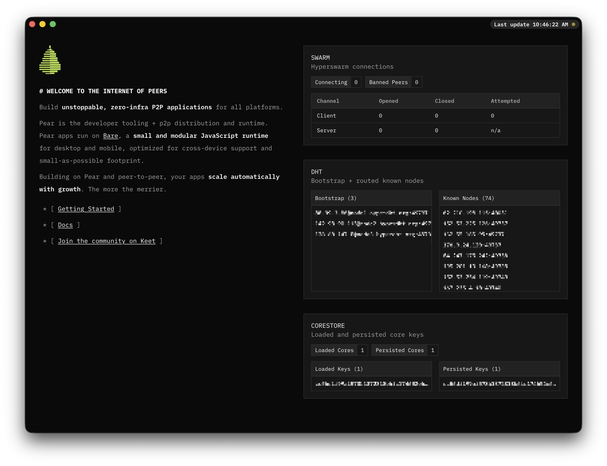

# Pear Desktop



Pear Desktop gives you a brief introspective view into how Pear Runtime is interacting with your system.

## Development

```
git clone https://github.com/holepunchto/pear-desktop
cd pear-desktop
npm run dev
```

## License

Apache-2.0
